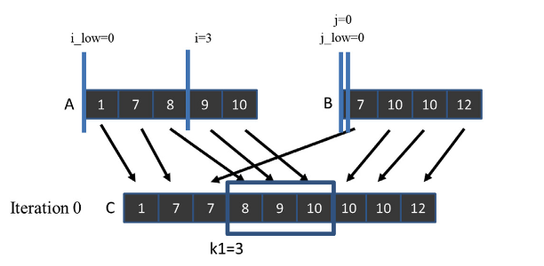

# Chapter 12

## Code

## Exercises

### Exercise 1

**Assume that we need to merge two lists A=(1, 7, 8, 9, 10) and B=(7, 10, 10, 12). What are the co-rank values for C[8]?**

Let's first recall what the `co_rank` function tells us—we use it to derive the beginning position of the subarrays `A` and `B` that will be used to merge into the subarray `C` starting at `k`. Let's first realize the final, merged array: `[1, 7, 7, 8, 9, 10, 10, 12]`. 

We see that the subarray starting at `8` will consist of only a single element—`12` taken from the array `B`. So the subarray `A` starts at index `5`-we don't take a single element, and for the subarray `B`, it starts at index `k-i = 8-5=3`, so it will consist of a single element `B[3]= 12`.

Now let's execute the `co_rank(8, A, 5, B, 4)`

```cpp
int co_rank(int k, int* A, int m, int* B, int n) {
    int i = k < m ? k : m; // i = min(k,m)
    int j = k - i;
    int i_low = 0 > (k-n) ? 0 : k-n; // i_low = max(0,k-n)
    int j_low = 0 > (k-m) ? 0 : k-m; // i_low = max(0,k-m)
    int delta;
    bool active = true;
    while(active) {
        if (i > 0 && j < n && A[i-1] > B[j]) {
            delta = ((i - i_low +1) >> 1) ; // ceil(i-i_low)/2)
            j_low = j;
            j = j + delta;
            i = i - delta;
        } else if (j > 0 && i < m && B[j-1] >= A[i]) {
            delta = ((j - j_low +1) >> 1) ;
            i_low = i;
            i = i + delta;
            j = j - delta;
        } else {
            active = false;
        }
    }
    return i;
}
```

Iteration 0 
```
i = min(k,m) = min(8,5) = 5
j = k - i = 8 - 5 = 3
i_low = max(0,k-n) = max(0,8-4) = max(0,4) = 4
j_low = max(0,k-m) = max(0,8-5) = max(0,3) = 3

m = 5
n = 4
```

First if `i>0✅ && j<n ✅ && A[4] > B[3]❌`

Second if `j>0 && i < m ❌`

So we execute the third if—ending the loop, returning `5`. So we ended up on the same value as in the intuitive explaination.

### Exercise 2

**Complete the calculation of co-rank functions for thread 2 in Fig. 12.6.**



Thread 2 starts at k=6, so we need to calculate `co_rank(6, A, 5, B, 4)`.  Intuitively, we see that the subarray `C[6:]` takes as an input nothing from the array `A` and three elements, starting at `1`, from array `B`. Hence, we expect the `co_rank` to be `5`, so that we know that we should take nothing from array `A` and start at `B[1]` for array `B`.

Let's now analyze it step by step:

```
m = 5
n = 4

i = min(k,m) = min(6,5) = 5
j = k - i = 6 - 5 = 1
i_low = max(0,k-n) = max(0,6-4) = max(0,2) = 2
j_low = max(0,k-m) = max(0,6-5) = max(0,1) = 1
```

First if `i>0✅ && j<n ✅ && A[4] > B[1]❌`

Second if `j>0 && i < m ❌`

So we trigger third case finishing the loop, returning `i=5` - same as we conculuded in the intuitive explaination.

### Exercise 3
**For the for-loops that load A and B tiles in Fig. 12.12, add a call to the co- rank function so that we can load only the A and B elements that will be consumed in the current generation of the while-loop.**


### Exercise 4

**Consider a parallel merge of two arrays of size 1,030,400 and 608,000. Assume that each thread merges eight elements and that a thread block size of 1024 is used.**

The resulting arrray will be of length `1,030,400 + 608,000 = 1,638,400` elements. 

**a. In the basic merge kernel in Fig. 12.9, how many threads perform a binary search on the data in the global memory?**

```cpp
__global__ void merge_basic_kernel(int* A, int m, int* B, int n, int* C) {
    int tid = blockIdx.x*blockDim.x + threadIdx.x;
    int elementsPerThread = ceil((m+n)/(blockDim.x*gridDim.x));
    int k_curr = tid*elementsPerThread; // start output index
    int k_next = min((tid+1)*elementsPerThread, m+n); // end output index
    int i_curr = co_rank(k_curr, A, m, B, n);
    int i_next = co_rank(k_next, A, m, B, n);
    int j_curr = k_curr - i_curr;
    int j_next = k_next - i_next;
    merge_sequential(&A[i_curr], i_next-i_curr, &B[j_curr], j_next-j_curr, &C[k_curr]);
}
```

And we call it with:

```cpp
merge_basic_kernel<<<dimGrid, dimBlock>>>(d_A, m, d_B, n, d_C);
```

For this kernel, each thread in the grid is performing a binary search

**b. In the tiled merge kernel in Figs. 12.11 - 12.13, how many threads perform a binary search on the data in the global memory?**

**c. In the tiled merge kernel in Figs. 12.11 - 12.13, how many threads perform a binary search on the data in the shared memory?**