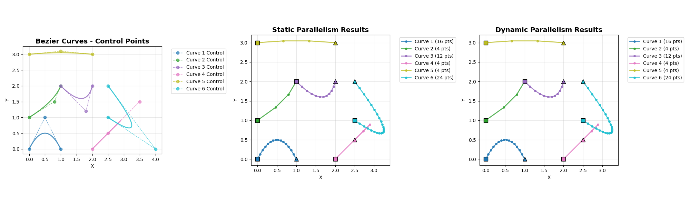

# Chapter 21

## Code

```bash
nvcc -shared -o libbezier.so -lcuda --compiler-options '-fPIC' -rdc=true bezier_curves.cu

python bezier.py
```

```logs
...

============================================================
PERFORMANCE BENCHMARK
============================================================

Benchmarking with 100 curves:
  Static:  1.069 ms
  Dynamic: 1.342 ms
  Speedup: 0.80x (Static faster)

Benchmarking with 500 curves:
  Static:  5.261 ms
  Dynamic: 5.732 ms
  Speedup: 0.92x (Static faster)

Benchmarking with 1000 curves:
  Static:  10.552 ms
  Dynamic: 11.184 ms
  Speedup: 0.94x (Static faster)
Displaying comparison visualization...
```




## Exercises

### Exercise 1
**Which of the following statements are true for the Bezier curves example?**
**a. If N_LINES=1024 and BLOCK_DIM=64, the number of child kernels that are launched will be 16.**
**b. If N_LINES=1024, the fixed-size pool should be reduced from 2048 (the default) to 1024 to get the best performance**

**c. If N_LINES=1024 and BLOCK_DIM=64 and per-thread streams are used, a total of 16 streams will be deployed.**

### Exercise 2
**Consider a two-dimensional organization of 64 equidistant points. It is classified with a quadtree. What will be the maximum depth of the quadtree (including the root node)?**
**a. 21**
**b. 4**
**c. 64**
**d. 16**


### Exercise 3
**For the same quadtree, what will be the total number of child kernel launches?**
**a. 21**
**b. 4**
**c. 64**
**d. 16**


### Exercise 4
**True or False: Parent kernels can define new __constant__ variables that will be inherited by child kernels.**

### Exercise 5
**True or False: Child kernels can access their parents’ shared and local memories.**


### Exercise 6

**Six blocks of 256 threads run the following parent kernel:**

```cpp
__global__ void parent_kernel(int *output, int *input, int *size) {
   // Thread index
   int idx = threadIdx.x + blockDim.x*blockIdx.x;
   
   // Number of child blocks
   int numBlocks = size[idx] / blockDim.x;
   
   // Launch child
   child_kernel<<<numBlocks, blockDim.x >>>(output, input, size);
}
```

**How many child kernels could run concurrently?**
**a. 1536**
**b. 256**
**c. 6**
**d. 1**


